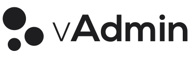

<h1 align="center">
Vueclean Admin Server
</h1>

The serverside behind Vueclean admin //Todo

## Build Setup

1. Just rename `server/config.example.json` into `server/config.json` and fill with your infos
2. Point your php server to `/api/`
3. Then specify in your vuecleanadmin config the url of the access point

For a detailed explanation on how things work, check out the [guide](http://vuejs-templates.github.io/webpack/) and [docs for vue-loader](http://vuejs.github.io/vue-loader).
